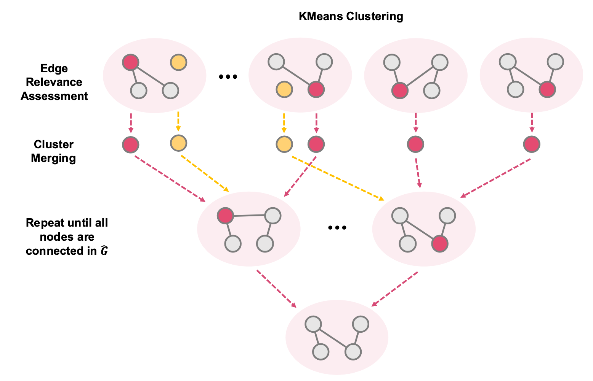

<!-- load MathJax -->

<!-- KaTeX -->
<link rel="stylesheet" href="https://cdn.jsdelivr.net/npm/katex/dist/katex.min.css">

# AI810 Blog Post (20248056)

## Supercharging Graph Neural Networks with Large Language Models

> **TL;DR** We show how to **re-wire** the edges of a text-attributed graph with the help of a large language model so that _any_ off-the-shelf GNN suddenly gets better - on average by ~2-3 percentage points, and by **up to 13 pp** on the IMDB benchmark.

---

## 1. Text-Attributed Graphs and Beyond

In our ever-evolving data landscape, **text-attributed graphs (TAGs)** have emerged as a powerful way to marry the structure of a graph with the richness of natural language. Imagine each node not just as an anonymous point but as a document - **a research-paper abstract**, a **web-page snippet**, or a **social post** - and each edge hinting at a deeper semantic tie. TAGs fuel applications from fact checking [Zhou _et al._, 2019] to recommendation engines [Zhu _et al._, 2021] and social-media insights [Li _et al._, 2022].
Traditionally, **graph neural networks (GNNs)** tap into these graphs by converting text into node features - think Sentence-BERT embeddings [Reimers & Gurevych, 2019] or distilled summaries - and then letting message-passing do the rest. Recent work shows that polishing these features with **lightweight pre-trained language models (PLMs)** or cleaning up raw text with **LLM-driven rewrites** can squeeze out extra accuracy [Yang _et al._, 2021; Chien _et al._, 2021; Zhao _et al._, 2022; He _et al._, 2023]. Yet these efforts leave the backbone - the **graph structure** - unchanged.
Meanwhile, the latest research hints at something more ambitious: **Can an LLM reason about a graph's topology itself?** [Wang _et al._ (2024)] showed that, in a toy setup, an LLM could suggest new edges if given an entire graph. But real-world TAGs can span millions of nodes - so feeding the whole thing to an LLM isn't scalable.
This is where **G-Enhancer** enters. Instead of just refining node content, we **rewire** the graph - asking an LLM, _"Does this pair of nodes really belong together?"_ - and selectively add or prune edges where it counts. By breaking the graph into bite-sized clusters, querying semantic relevance, and iteratively regrouping any orphans and high-degree hubs, G-Enhancer leverages LLM smarts to reshape connectivity at scale. The result? An off-the-shelf GNN suddenly becomes a sharper, more insightful learner.
What's more, such a design even works **beyond graphs**. Tabular data often contain textual attributes - movie plots, product reviews, and more. Because G-Enhancer can create an adjacency matrix from scratch, we can bring the power of message passing to settings where rows were once processed in isolation.

## 2. A Bit of Preliminaries

### How GNNs tackle node classification

Let's start with the basic setup. We have a **text-attributed graph**

$$
\mathcal{G} = (\mathcal{V}, \mathcal{E}, \mathcal{T})
$$

where

- $\mathcal{V}$ is the set of $N$ nodes, each with its own text $t_i\in\mathcal{T}$,
- $\mathcal{E}$ is the set of $M$ undirected edges,
- and $\mathbf{A}\in\{0,1\}^{N\times N}$ is the adjacency matrix ($A_{ij}=1$ if nodes $i,j$ are connected).

Each node's text is encoded by a frozen pre-trained language model $g_{\boldsymbol\phi}$ (e.g., Sentence-BERT), producing a feature matrix

$$
\mathbf{X} = [\mathbf{x}_1, \mathbf{x}_2, \dots, \mathbf{x}_N]^\top
= g_{\boldsymbol\phi}(\mathcal{T})
\;\in\mathbb{R}^{N\times F}\,.
$$

A Graph Neural Network $f_{\boldsymbol\theta}$ then learns to classify nodes by repeatedly **aggregating** information from each node's neighborhood $\mathcal{N}_i$. At layer $l$, the node update is:

$$
\mathbf{h}_i^{(l+1)}
= \psi\!\bigl(\mathbf{h}_i^{(l)},\;\mathrm{AGG}\{\mathbf{h}_j^{(l)} : j\in\mathcal{N}_i\}\bigr),
$$

where

- $\mathbf{h}_i^{(0)} = \mathbf{x}_i$,
- $\mathrm{AGG}$ might be mean-pooling, attention, or another aggregator,
- and $\psi$ fuses the node's own state with its neighbors'.

After $L$ layers, the GNN produces logits $\mathbf{Z} = f_{\boldsymbol\theta}(\mathbf{X}, \mathbf{A})$, which we turn into class probabilities $\mathbf{P} = \mathrm{Softmax}(\mathbf{Z})$. Training uses the cross-entropy loss:

$$
\mathcal{L}_{\boldsymbol\theta}
= -\frac{1}{N}\sum_{i=1}^{N}\sum_{k=1}^{K} Y_{ik}\,\log P_{ik}\,,
$$

where $K$ is the number of classes and $Y_{ik}$ are one-hot labels.

### Prompting LLMs

Large Language Models (LLMs) such as GPT-3 [Brown _et al._, 2020] or LLaMA-3 [Touvron _et al._, 2023] with billions of parameters can **reason** straight out of the box—no fine-tuning needed—just by giving them the right **prompt**. You prepend a natural-language instruction $\mathbf{s}$ to your query sequence $\mathbf{q} = \{q_1, q_2, \dots, q_n\},$ forming the combined input $\widetilde{\mathbf{q}} = [\mathbf{s}]\;\cup\;\mathbf{q}$ and feed it to the model $\mathcal{M}$. The output is a token sequence $\mathbf{a} = \mathcal{M}(\widetilde{\mathbf{q}})$, which (hopefully) contains the answer you need.

## 3. How should LLMs be used in graphs?

### The scalability and feature gaps of NLGraph

NLGraph [Wang _et al._, 2024] was the first to show that off-the-shelf LLMs can _reason_ about graph structure: you literally describe each node and edge in words, then ask "are these two nodes connected?" or "find a clique of size 4"—and, impressively, the model often gets it right. But this comes with two big catches:

1. **Context-window overload.** NLGraph feeds _the entire graph_—all node texts plus all edges—into the LLM as one long prompt. That works for toy examples, but real TAGs quickly blow past the ~4,000–8,000 token limits of even the biggest models. Consider Cora, with over 2 000 paper abstracts and tens of thousands of edges—far too much to fit.
2. **Feature blindness.** By treating nodes merely as text blobs, NLGraph ignores the fact that modern GNNs excel when they combine _both_ structure and rich pre-computed node embeddings (e.g. from Sentence-BERT). In other words, NLGraph shows the capability of the _zero-shot_ capability of LLMs, but does not explore upon how can it _aid_ conventional GNNs, which have shown impressive performance in this traditional task.

Despite these shortcomings, NLGraph's core insight remains powerful: **LLMs can suggest new edges**—but only if we solve these scalability and feature-integration issues.

### A toy example - LLMs as graph enhancers

Building on NLGraph, we ask: _What if we could harness LLMs' world knowledge to *selectively* rewire a graph—rather than dump the whole thing into the context window?_ To test out this hypothesis, we conduct a toy-experiment.

1. Sample a manageable 10% of the subset of nodes in the graph
2. For each node pair $i$ and $j$, Ask the LLM:
   > "Given the abstract of paper _i_ and paper _j_, and knowing we're doing node classification on research topics, would linking these two help the classifier?"
3. Gathering the answers, construct a new adjacency matrix $\hat{\mathcal{G}}$, which reflects the _semantic relevance_, and _efficacy in downstream task_ at once.
4. Using the obtained $\hat{\mathcal{G}}$, train the GNN model.

| Model |        Graph        |    Pubmed (%)     |     Cora (%)      |     IMDB (%)      |
| :---: | :-----------------: | :---------------: | :---------------: | :---------------: |
|  GCN  |    $\mathcal{G}$    |   80.67 +- 3.27   | **65.71 +- 2.02** |   48.00 +- 3.71   |
|  GCN  | $\hat{\mathcal{G}}$ | **86.33 +- 1.00** |   63.29 +- 1.81   | **57.00 +- 4.07** |
|  GAT  |    $\mathcal{G}$    |   76.00 +- 3.27   |   65.14 +- 2.32   |   43.67 +- 6.05   |
|  GAT  | $\hat{\mathcal{G}}$ | **81.67 +- 3.73** | **67.43 +- 2.19** | **46.67 +- 3.94** |

When we train standard GNNs (GCN, GAT, GT, SEH-GNN, etc.) on our **rewired** graph $\hat{\mathcal{G}}$ instead of the original $\mathcal{G}$, we see consistent gains - even on both homophilous benchmarks like PubMed [Sen _et al._, 2008] and Cora [McCallum _et al._, 2000] _and_ the challenging heterophilous IMDB dataset [Fu _et al._, 2020].

> **Takeaway:** By marrying LLM-driven semantic edge predictions with classic GNN feature aggregation, we unlock a new axis of improvement that neither approach could achieve alone.

## 4. An LLM-based Rewiring Strategy - G-Enhancer

Building on the promise of LLM-driven edge suggestions, **G-Enhancer** tackles the size and complexity of real-world TAGs with a divide-and-conquer rewiring pipeline. At a high level, we:

1. **Partition** the graph into feature-similar clusters.
2. **Ask** the LLM which node pairs inside each cluster deserve an edge.
3. **Reconnect** any lonely nodes by merging and repeating.
   This ensures **every** node gains meaningful links—while keeping the total LLM queries low.

An outline of the whole pipeline is displayed above.

### Partition nodes into sub-clusters

To avoid overwhelming the LLM, we first split $\mathcal{G} = (\mathcal{V}, \mathcal{E}, \mathcal{T})$ into $C$ compact clusters $\{\mathcal{C}_1,\dots,\mathcal{C}_C\}$ based on feature vectors $\mathbf{X}\in\mathbb{R}^{N\times F}$. Concretely, KMeans assigns each node $i$ to the nearest centroid:

$$
\mathcal{C}_c = \bigl\{\,i : \|\mathbf{x}_i - \boldsymbol\mu_c\|\le \|\mathbf{x}_i - \boldsymbol\mu_{c'}\|\ \forall c'\bigr\}.
$$

To cap the work per cluster, we impose a maximum size $m$ via a minimum-cost flow solver—so each cluster has at most $\binom{m}{2}$ candidate edges. For very large graphs, we recurse: clusters bigger than $m$ get re-KMeans'd until all are small enough.

### Ask LLM, should we connect?

We provide (1) dataset statistics and information, (2) raw text for each node, and ask the LLM whether we should connect these nodes for constructing a meaningful graph beneficial for downstream task. Specifically, the prompt is constructed as follows:

> You are tasked with analyzing a graph consisting of **nodes representing papers and edges representig co-citation**.
> The predefined categories of nodes are: **[Rule Learning, Neural Networks, Case Based, Genetic Algorithms, Theory, Reinforcement Learning, Probabilistic Methods]**.
> Your objective is to **identify relevant semantic relations beneficial for determining each nodes' associated category**.
> **INPUT FORMAT**: Node 1: [Paper Abstract 1], Node 2: [Paper Abstract 2] ...
> **OUTPUT FORMAT**: (Node1, Node2), (Node2, Node3) ...
> Strictly abide to the given format.

### Reconnect lonely edges

Isolated nodes are harmful in performance, because they cannot perform message-passing with any other nodes - thus, their representations cannot be updated. Thus there needs to be an mitigation strategy. Thus, we:

1. **Re-select** Gather nodes with no new edges, along with those that have the highest degree in each cluster, in hope that they would become connected to isolated nodes from other clusters.
2. **Re-cluster** these "troublemakers(_i.e._ isolated nodes) and trouble-solvers (_i.e._ high-degree nodes) " using the same KMeans+size cap.
3. **Re-query** edges inside each new mini-cluster. We repeat until every node has at least one connection in $\hat{\mathcal{G}}$. The result is a **fully connected**, **LLM-enhanced** graph fed to any off-the-shelf GNN $f_{\boldsymbol\theta}$ on $(\mathbf{X},\hat{\mathbf{A}})$.

This three-stage pipeline balances **scalability**, **semantic precision**, and **complete coverage**—making LLM-powered rewiring practical for graphs of any size. Note that for practical issues, we add a patience parameter to each node, ticking off every time it becomes isolated in each round. This is to ensure that there is no endless loop of queries passing on and on.

## 5. Does it Work?

Absolutely. Drop $\hat A$ into _any_ GNN and you almost always do better.

| Model                            | Cora (%)      | Pubmed (%)    | WikiCS (%)    | IMDB (%)      | Arxiv (%)     | History (%)   | Avg. Gain (%) |
| :------------------------------- | :------------ | :------------ | :------------ | :------------ | :------------ | :------------ | :-----------: |
| **GCN**                          | 87.72 +- 0.48 | 86.22 +- 0.48 | 81.17 +- 0.48 | 61.40 +- 0.48 | 73.84 +- 0.48 | 83.02 +- 0.48 |       -       |
| **GCN + $\hat{\mathcal{G}}$**    | 87.90 +- 0.48 | 89.16 +- 0.48 | 84.83 +- 0.48 | 74.90 +- 0.48 | 74.98 +- 0.48 | 84.76 +- 0.48 |    + 2.91     |
| **GAT**                          | 87.26 +- 0.48 | 87.82 +- 0.48 | 82.19 +- 0.48 | 62.78 +- 0.48 | 73.07 +- 0.48 | 83.37 +- 0.48 |       -       |
| **GAT + $\hat{\mathcal{G}}$**    | 87.44 +- 0.48 | 89.02 +- 0.48 | 84.14 +- 0.48 | 73.67 +- 0.48 | 74.78 +- 0.48 | 84.52 +- 0.48 |    + 2.20     |
| **GT**                           | 86.22 +- 0.48 | 85.48 +- 0.48 | 79.49 +- 0.48 | 67.65 +- 0.48 | 76.14 +- 0.48 | 81.66 +- 0.48 |       -       |
| **GT + $\hat{\mathcal{G}}$**     | 86.54 +- 0.48 | 89.03 +- 0.48 | 83.59 +- 0.48 | 74.36 +- 0.48 | 74.74 +- 0.48 | 83.26 +- 0.48 |    + 2.90     |
| **SeHGNN**                       | 86.76 +- 0.48 | 88.01 +- 0.48 | 82.53 +- 0.48 | 62.76 +- 0.48 | 74.63 +- 0.48 | 84.07 +- 0.48 |       -       |
| **SeHGNN + $\hat{\mathcal{G}}$** | 87.35 +- 0.48 | 89.63 +- 0.48 | 84.78 +- 0.48 | 75.46 +- 0.48 | 76.22 +- 0.48 | 84.70 +- 0.48 |    + 2.96     |
| **Query Reduction (%)**          | - 91.77       | - 99.69       | - 99.12       | - 95.40       | - 99.30       | - 99.43       |       -       |

Across six benchmarks, we evaluate the performance of synthetic adjacency graph created by LLaMA-3 8b model across four GNN architectures. The average lift is **2 - 3 pp**, with _IMDB_ jumping a full **13 pp**. Better still, we needed **< 10 %** of the pairwise queries that a naive approach would have issued.

As discussed before, one of the key benefits is that we can actually create synthetic connections even for datas that **do not have adjacency matrix in the first place**. To verify this, we did additional experiments on _tabular datasets_. All the selected datasets contain textual attributes - such as reviews - for the LLM to perform semantic reasoning upon.

|                  Model                   |  Titanic (%)  | Wine Quality (%) |  Compas (%)   | Mushroom (%)  | IMDB-tabular (%) | Product Reviews (%) | Avg. Gain (%) |
| :--------------------------------------: | :-----------: | :--------------: | :-----------: | :-----------: | :--------------: | :-----------------: | :-----------: |
|                 **MLP**                  | 81.33 +- 0.79 |  74.62 +- 0.30   | 66.52 +- 0.48 | 99.86 +- 0.03 |  94.64 +- 2.17   |    87.77 +- 0.18    |       -       |
|      **MLP + $\hat{\mathcal{G}}$**       | 82.17 +- 0.73 |  78.24 +- 0.38   | 69.01 +- 0.38 | 99.88 +- 0.03 |  95.10 +- 2.18   |    91.56 +- 0.19    |    + 2.41     |
|                **TabNet**                | 79.94 +- 0.96 |  75.25 +- 0.35   | 61.78 +- 0.76 | 99.35 +- 0.19 |  88.29 +- 2.02   |    89.20 +- 0.21    |       -       |
|     **TabNet + $\hat{\mathcal{G}}$**     | 82.91 +- 0.69 |  76.38 +- 0.35   | 66.35 +- 0.62 | 99.78 +- 0.06 |  93.66 +- 2.12   |    91.44 +- 0.20    |    + 3.61     |
|            **TabTransformer**            | 79.30 +- 0.90 |  71.89 +- 0.44   | 66.06 +- 0.37 | 99.80 +- 0.05 |  75.45 +- 0.98   |    87.76 +- 0.16    |       -       |
| **TabTransformer + $\hat{\mathcal{G}}$** | 81.24 +- 0.61 |  73.43 +- 0.47   | 67.00 +- 0.28 | 99.80 +- 0.04 |  78.54 +- 0.65   |    89.71 +- 0.17    |    + 2.05     |

Specifically, what I did was simple (1) create $\hat{\mathcal{G}}$ via LLM through querying, and (2) add an additional message-passing layer on top of traditional tabular DNN architectures (TabNet [Arik, S. O. & Pfister, T. (2020)], TabTransformer [Huang, X. _et al._ (2020)]). With such simple integration, $\hat{\mathcal{G}}$ enhances performance, on average, across all architecture types!

## 6. Why It Matters

**In short, G-Enhancer delivers all the benefits you want in one neat package**: it slots transparently into your existing GNN - no architecture rewrites required - by simply swapping in a smarter adjacency matrix; it only asks the LLM to judge edges where it really matters; and it isn't tied to one graph style or domain due to the vast knowledge base it was trained upon, thriving on both homophilous and heterophilous networks - and even breathing life into purely tabular data by inventing edges from scratch. Together, these qualities make G-Enhancer a truly practical way to inject world-knowledge-driven structure into graph learning at scale.

## 7. References

- Arik, S. O. & Pfister, T. (2020). _TabNet: Attentive Interpretable Tabular Learning_.
- Brown, T. _et al._ (2020). _Language Models Are Few-Shot Learners_.
- Chien, E. _et al._ (2021). _Node Feature Extraction by Self-Supervised Multi-Scale Neighborhood Prediction_.
- Fu, X. _et al._ (2020). _MAGNN: Metapath Aggregated Graph Neural Network for Heterogeneous Graph Embedding_.
- Grinsztajn, L., Oyallon, E. & Varoquaux, G. (2022). _Why Do Tree-Based Models Still Outperform Deep Learning on Tabular Data?_
- He, X. _et al._ (2023). _Harnessing Explanations: LLM-to-LM Interpreter for Enhanced Text-Attributed Graph Representation Learning_.
- Huang, X. _et al._ (2020). _TabTransformer: Tabular Data Modeling Using Contextual Embeddings_.
- Kipf, T. N. & Welling, M. (2016). _Semi-Supervised Classification with Graph Convolutional Networks_.
- Li, Q. _et al._ (2022). _Distilling Knowledge on Text Graph for Social-Media Attribute Inference_.
- McCallum, A. K. _et al._ (2000). _Automating the Construction of Internet Portals with Machine Learning_.
- Reimers, N. & Gurevych, I. (2019). _Sentence-BERT: Sentence Embeddings Using Siamese BERT-Networks_.
- Sen, P. _et al._ (2008). _Collective Classification in Network Data_.
- Touvron, H. _et al._ (2023). _LLaMA: Open and Efficient Foundation Language Models_.
- Velicković, P. _et al._ (2017). _Graph Attention Networks_.
- Wang, H. _et al._ (2024). _Can Language Models Solve Graph Problems in Natural Language?_
- Yang, J. _et al._ (2021). _Graphformers: GNN-Nested Transformers for Representation Learning on Textual Graphs_.
- Yang, X. _et al._ (2023). _Simple and Efficient Heterogeneous Graph Neural Network (SeHGNN)_.
- Yun, S. _et al._ (2019). _Graph Transformer Networks_.
- Zhao, J. _et al._ (2022). _Learning on Large-Scale Text-Attributed Graphs via Variational Inference_.
- Zhou, J. _et al._ (2019). _GEAR: Graph-Based Evidence Aggregating and Reasoning for Fact Verification_.
- Zhu, J. _et al._ (2021). _TextGNN: Improving Text Encoder via Graph Neural Network in Sponsored Search_.
